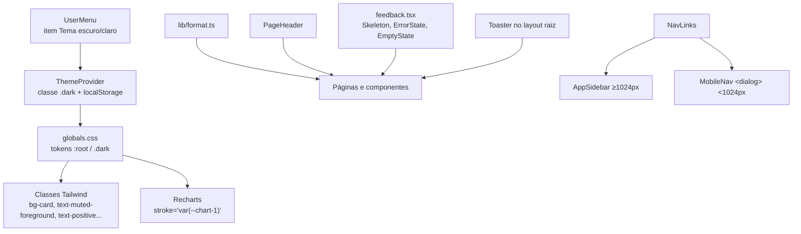

# Fundação de UI — Design

**Spec**: `.specs/features/fundacao-ui/spec.md`
**Status**: Draft

---

## Abordagens consideradas

Todas entregam o mesmo escopo (spec UI-01..UI-12).

| | Abordagem | Prós | Contras |
|---|---|---|---|
| **A (recomendada)** | Variáveis CSS do shadcn já existentes em `globals.css` + classes Tailwind; cores de gráfico como `var(--chart-N)` direto nas props do Recharts; gaveta mobile com `<dialog>` nativo | Zero dependência nova; tema troca só a classe `.dark`; Recharts aceita `var()` (padrão do shadcn chart) | Precisa reescrever cores escritas à mão em ~19 arquivos |
| B | Objeto de tema em TypeScript (`theme.ts`) lido via hook | Cores tipadas | Componentes re-renderizam na troca de tema; duplica o que o CSS já faz |
| C | Adotar componentes shadcn `sidebar`, `sheet` e `chart` inteiros | Visual pronto | ~800 linhas novas de componentes genéricos para um menu de 20 links |

**Escolha: A.** Conforma AD-002 (um sistema de tema), AD-005 (gaveta < 1024px) e AD-001 (simples).

---

## Architecture Overview

---

## Code Reuse Analysis

| Existente | Local | Uso |
|---|---|---|
| Tokens shadcn (claro e escuro) | `frontend/app/globals.css:59-128` | Base; ganha tokens de marca, positivo/negativo e paleta de gráficos |
| `ThemeProvider` + `useTheme` | `frontend/components/ThemeProvider.tsx` | Mantido; padrão passa a seguir o sistema operacional |
| Script anti-flash | `frontend/app/layout.tsx:30-34` | Ajustado para `prefers-color-scheme` |
| `Toaster` (sonner) | `frontend/components/ui/sonner.tsx` | Troca `next-themes` pelo `useTheme` próprio e passa a ser montado |
| `NAV_SECTIONS` | `frontend/components/layout/AppSidebar.tsx:7` | Extraído para `NavLinks`, usado no menu fixo e na gaveta |
| `Card`, `Button`, `Tabs`, `Table` | `frontend/components/ui/` | Sem mudança |
| `apiFetch` / `ApiError` | `frontend/lib/api.ts` | Mensagens de erro dos toasts e do `ErrorState` |

---

## Components

### `lib/format.ts`
- **Purpose**: formatar números para exibição em pt-BR.
- **Interfaces**:
  - `formatNumber(v, casas = 2): string` — "1.234,50"
  - `formatBRL(v): string` — "R$ 1.234,50"; negativo "-R$ 10,00"
  - `formatCents(v): string` — "21,46 ¢/lb"
  - `formatFX(v): string` — "R$ 5,4322"
  - `formatPercent(fracao, casas = 2): string` — 0.0523 → "5,23%"
  - `formatCompactBRL(v): string` — ≥ 1 milhão → "R$ 27,8 mi"
  - `formatDate(iso): string` — "05/10/2026"
  - Todas devolvem "—" para `null`, `undefined` ou `NaN`.
- **Reuses**: `Intl.NumberFormat("pt-BR")` (stdlib).

### Tokens (`app/globals.css`)
Tokens novos, definidos em `:root` e `.dark` e mapeados no `@theme inline`:

| Token | Claro | Escuro | Uso |
|---|---|---|---|
| `--chart-1` | `#2a78d6` | `#3987e5` | série 1 (azul — dólar) |
| `--chart-2` | `#eb6834` | `#d95926` | série 2 (laranja — açúcar) |
| `--chart-3` | `#1baf7a` | `#199e70` | série 3 |
| `--chart-4` | `#eda100` | `#c98500` | série 4 |
| `--chart-5` | `#e87ba4` | `#d55181` | série 5 |
| `--positive` | `#006300` | `#0ca30c` | alta / ganho (texto) |
| `--negative` | `#d03b3b` | `#e66767` | queda / perda (texto) |
| `--brand` | `#2563eb` | `#3987e5` | link ativo, destaque |
| `--sidebar` | `#111827` | `#0b0f19` | menu lateral (escuro nos dois temas, identidade atual) |
| `--chart-grid` | `#e1e0d9` | `#2c2c2a` | grade dos gráficos |

Paleta de gráficos validada com `dataviz/scripts/validate_palette.js`: claro e escuro passam em todos os critérios. No tema claro, os slots 3, 4 e 5 ficam abaixo de 3:1 contra o fundo, então gráficos que os usam levam rótulo direto ou legenda (regra do validador).

### `ThemeProvider` (modificado)
- Estado inicial: `localStorage.theme` se existir; senão `matchMedia("(prefers-color-scheme: dark)")`.
- `localStorage` dentro de `try/catch` (edge case do modo privado).

### `PageHeader` — `components/layout/PageHeader.tsx`
- `PageHeader({ titulo, descricao, acoes?, atualizadoEm? })` → `<h1>` + frase + área de ações à direita (empilha no celular).

### `feedback.tsx` — `components/ui/feedback.tsx`
- `Skeleton({ className })` — bloco `animate-pulse bg-muted`.
- `ErrorState({ mensagem, onRetry })` — mensagem + botão "Tentar novamente".
- `EmptyState({ mensagem, acao? })` — frase + ação opcional.

### `NavLinks` — `components/layout/NavLinks.tsx`
- Lista de seções e links (hoje em `AppSidebar`), com `onNavigate?` para fechar a gaveta.

### `MobileNav` — `components/layout/MobileNav.tsx`
- Botão "Menu" (visível `< lg`) que abre um `<dialog>` com `showModal()`: o navegador já trata Esc, foco preso e fundo. Clique no fundo fecha (`e.target === dialog`). Fecha ao navegar (`onNavigate`). Foco vai ao primeiro link ao abrir.

### Layout `/app` (modificado)
- Cabeçalho: `MobileNav` à esquerda (< lg), status do mercado e menu do usuário à direita; faixa de cotações com rolagem horizontal própria.
- `AppSidebar` com `hidden lg:flex`.
- Conteúdo com espaçamento padrão `px-4 py-6 sm:px-6 lg:px-8`.

### Páginas
Cada rota de `/app` passa a usar `PageHeader`, `format.ts`, tokens, feedback e grades responsivas (`grid-cols-1 md:grid-cols-2 xl:grid-cols-3`). Formulário + resultado: `grid xl:grid-cols-[380px_1fr]`.

### Gráficos
- Recharts: `stroke="var(--chart-N)"`, grade `var(--chart-grid)`, tooltip e eixos com `format.ts`.
- `AtrHistorico`, `AcucarCharts`, `DolarCharts` migram de Plotly para Recharts. `FixacoesChart` (candlestick) continua no Plotly, com cores lidas dos tokens via `getComputedStyle` ao trocar o tema.

---

## Error Handling Strategy

| Cenário | Tratamento | O que o usuário vê |
|---|---|---|
| Ação do usuário falha | `catch (e)` → `toast.error(e.message)` | Toast vermelho com a mensagem do `apiFetch` |
| Ação conclui | `toast.success("<o que foi feito>")` | Toast verde, ex.: "Simulação salva" |
| Carga inicial falha | `ErrorState` com `onRetry` | Mensagem + "Tentar novamente" no lugar do conteúdo |
| Lista vazia | `EmptyState` | Frase + ação para criar o primeiro item |
| Valor nulo/NaN | `format.ts` | "—" |
| `localStorage` bloqueado | `try/catch` no tema | Tema do sistema, sem erro |

---

## Risks & Concerns

| Concern | Location | Impact | Mitigation |
|---|---|---|---|
| Script anti-flash força escuro quando não há preferência salva | `frontend/app/layout.tsx:33` | Pisca tema errado; ignora o sistema | T3 troca por `prefers-color-scheme` |
| `sonner` usa `next-themes`, que não tem provider montado | `frontend/components/ui/sonner.tsx:10` | Toast sempre no tema "system", desalinhado | T3 usa o `useTheme` próprio e remove `next-themes` |
| `<Toaster>` não está montado | `frontend/app/layout.tsx` | Toasts de Fixações, Mercado e Admin nunca aparecem | T4 monta no layout raiz |
| Landing pública com 38 cores à mão | `frontend/app/page.tsx` | Maior arquivo da migração de cores | Task própria (T29) |
| Sem testes de componente (sem jsdom/RTL) | `frontend/` | Comportamento visual não é verificado automaticamente | Regras verificáveis viram testes que varrem o código (T31); gaveta, tema e 360px vão para UAT |
| Plotly pesa ~3 MB no bundle | `components/market/FixacoesChart.tsx` | Carregamento lento | Fica só em Fixações (carregado só ali); os outros 3 saem |

---

## Tech Decisions

| Decisão | Escolha | Motivo |
|---|---|---|
| Gaveta mobile | `<dialog>` nativo | Esc, foco e fundo de graça; sem dependência |
| Cores em gráficos | `var(--chart-N)` nas props do Recharts | Troca de tema sem re-render |
| Regras de código (sem hex, sem `toFixed`, `<h1>` só no `PageHeader`) | Teste vitest que varre `app/` e `components/` | Regra da spec vira gate executável |
| Menu lateral | Escuro nos dois temas | Mantém a identidade atual |

Decisão de projeto adicionada em `.specs/STATE.md`: **AD-008** — toda cor de interface vem de token em `globals.css`; números exibidos passam por `lib/format.ts`.
