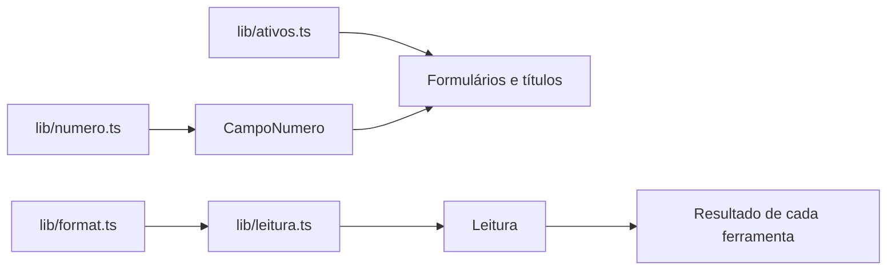

# Linguagem clara — Design

**Spec**: `.specs/features/linguagem-clara/spec.md`
**Status**: Draft

---

## Abordagem

Os textos vivem perto da tela que os usa; o que é lógica (converter número, montar frase) vira função pura em `lib/`, testada. Três peças novas:

| Peça | Local | Por quê |
|---|---|---|
| `lib/ativos.ts` | nome e unidade de cada ativo | Um mapa só (LING-05); hoje cada tela escreve "SB=F" do seu jeito |
| `lib/numero.ts` | ler "10,5" e validar faixa | Inputs `type="number"` recusam vírgula em navegadores pt-BR (LING-02) |
| `lib/leitura.ts` | frase de leitura de cada resultado | Frase = função de números → testável 1:1 com a spec (LING-03/04) |
| `components/ui/campo-numero.tsx` | campo numérico com rótulo, unidade, ajuda, % e erro de faixa | Mesmo comportamento em ~40 campos |
| `components/ui/leitura.tsx` | caixa de destaque com a frase | Mesmo visual em todas as ferramentas |

Alternativa descartada: biblioteca de i18n. Só há um idioma; seria indireção sem ganho (AD-001).

---

## Code Reuse Analysis

| Existente | Local | Uso |
|---|---|---|
| `format.ts` | `frontend/lib/format.ts` | Toda frase formata números por ele |
| `FieldTooltip` | `frontend/components/ui/field-tooltip.tsx` | Ajuda de cada campo; ganha link para o glossário (P3) |
| `Input`, `Label` | `frontend/components/ui/` | Base do `CampoNumero` |
| `TickerSelect` | `frontend/components/market/TickerSelect.tsx` | Passa a ler nomes de `ativos.ts`; vira o seletor do Monte Carlo |
| `NavLinks` | `frontend/components/layout/NavLinks.tsx` | Nomes novos do menu (LING-06) |
| `PageHeader` | `frontend/components/layout/PageHeader.tsx` | Descrições já escritas na fundacao-ui; revisadas aqui |

---

## Components

### `lib/ativos.ts`
- `ATIVOS: Record<string, { nome: string; unidade: "¢/lb" | "R$/US$" | "US$/barril" | "" }>` — SB=F "Açúcar NY nº 11", USDBRL=X "Dólar (USD/BRL)", CL=F "Petróleo WTI", SBK26.NYB "Açúcar NY maio/2026".
- `nomeAtivo(ticker): string` — nome do mapa ou o próprio código (LING-05 AC2).

### `lib/numero.ts`
- `lerNumero(texto: string): number | null` — aceita "10,5", "10.5", "1.234,5" (milhar com ponto + vírgula decimal) e "1234.5"; vazio ou inválido → `null`.
- `erroFaixa(valor, min, max, unidade): string | null` — `"Use um valor entre <mín> e <máx> <unidade>."` com números em pt-BR.

### `CampoNumero`
- Props: `id, rotulo, unidade?, ajuda, valor (string), onChange(texto), min?, max?, percentual?, opcional?`.
- Renderiza `Label` "<rotulo> (<unidade>)" + `FieldTooltip` + `Input type="text" inputMode="decimal"`.
- `percentual`: o usuário vê e digita em % (10,5); quem lê o valor usa `lerNumero(texto) / 100`.
- Mostra `erroFaixa` abaixo do campo quando o texto não está vazio e sai da faixa (LING-02 AC6).
- Exporta `campoValido(texto, {min, max, opcional})` para o formulário bloquear o envio.

### `Leitura`
- `<Leitura>{frase}</Leitura>` — bloco com ícone de lâmpada, fundo `bg-brand/10`, texto `text-foreground`, `role="status"`. Fica logo abaixo do `PageHeader` do resultado.

---

## Textos por tela

### Rótulos (LING-01)

Formato: **nome (unidade)**; símbolo técnico só entre parênteses. Campos marcados **%** recebem percentual e convertem para fração.

| Tela | Antes | Depois | Faixa |
|---|---|---|---|
| Monte Carlo | Ticker | Ativo (seletor com nomes) | — |
| | Preço inicial | Preço de partida (¢/lb ou R$/US$, conforme o ativo) | > 0 |
| | Dias simulados | Prazo da simulação (dias úteis) | 1–1.260 |
| | Número de simulações | Quantidade de cenários | 100–50.000 |
| | Limite percentual (pct_bound) | Variação máxima do preço (%) **%** | 1–100 |
| Opções BS/MC | S (Preço atual) | Preço atual do ativo | > 0 |
| | K (Strike) | Preço de exercício (strike) | > 0 |
| | T (Anos até vencimento) | Prazo até o vencimento (anos) | 0,01–30 |
| | r (Taxa livre de risco) | Taxa de juros anual (%) **%** | 0–100 |
| | σ (Volatilidade) | Volatilidade anual (σ, %) **%** | 0,1–500 |
| | Nº de simulações | Quantidade de cenários | 100–100.000 |
| Payoff | Tipo / Posição / Strike / Prêmio / Quantidade | Tipo (call = direito de comprar; put = direito de vender) / Posição (comprado ou vendido) / Preço de exercício / Prêmio por contrato / Contratos | — |
| Parâmetros | Volatilidade anual customizada (0–5) | Volatilidade anual (%) **%** | 0–500 |
| | Taxa livre de risco (-0.5–1) | Taxa de juros anual (%) **%** | −50–100 |
| | PCT Bound preferido (0.05–2) | Variação máxima do preço (%) **%** | 5–200 |
| Jump Diffusion | Sigma (vol) | Volatilidade diária (%, opcional) **%** | 0,01–20 |
| | Steps | Prazo (dias úteis) | 10–1.260 |
| | λ saltos | Saltos por ano | 0–5 |
| | μ salto | Tamanho médio do salto (%) **%** | −100–100 |
| | σ salto | Variação do tamanho do salto (%) **%** | 0–100 |
| Cenários | NY (¢/lb) / Moagem Total / Câmbio (R$) / Preço Etanol (R$/m³) | Açúcar NY (¢/lb) / Moagem (t de cana) / Câmbio (R$/US$) / Etanol (R$/m³) | > 0 |
| Risco | Moagem Total / ATR / VHP Total / NY / Câmbio / Preço CBIOS / Preço Etanol; colunas Média, P15, P85 | Moagem (t de cana) / ATR (kg/t) / VHP total (t) / Açúcar NY (¢/lb) / Câmbio (R$/US$) / CBIO (R$) / Etanol (R$/m³); colunas Média, Cenário baixo (P15), Cenário alto (P85) | > 0 |
| Breakeven | Preço açúcar (¢/lb) / Câmbio USD/BRL / Fator de conversão | Açúcar NY (¢/lb) / Câmbio (R$/US$) / Fator ¢/lb → R$/saca | > 0 |
| Regressão dólar | Selic / M2 BCB / Prod. Industrial BCB / Fed Funds / M2 EUA / Prod. Industrial EUA | Selic (% ao ano) / Dinheiro em circulação no Brasil, M2 (R$ bilhões) / Produção industrial no Brasil (índice) / Juros dos EUA, Fed Funds (% ao ano) / Dinheiro em circulação nos EUA, M2 (US$ bilhões) / Produção industrial nos EUA (índice) | > 0 |
| Regressão açúcar | Estoque Inicial (Mt) … CL=F (Petróleo, USD/bbl); Modelo ridge/xgboost | Estoque inicial mundial (milhões de t) / Produção mundial / Consumo mundial / Estoque final mundial (milhões de t) / Estoque sobre consumo (%) / Câmbio (R$/US$) / Petróleo WTI (US$/barril); Modelo: Linear (Ridge) ou Árvores (XGBoost) | > 0 |
| ATR | Chuva (mm) / Impureza (%) / Volume de Moagem (ton/safra) | Chuva no mês (mm) / Impureza total (%) / Moagem da safra (t de cana, opcional) | 0–1.000 / 0–100 / > 0 |
| Fixações | RSI — Período, BB — Janela … | RSI: período (dias), Bollinger: período (dias), Bollinger: desvios-padrão, MACD: média rápida/lenta/sinal (dias), Estocástico: %K/%D (dias), CCI: período (dias), Médias simples/exponenciais (dias, separadas por vírgula) | 2–250 |
| Análise técnica | Ticker / Início / Fim | Ativo (código Yahoo) / De / Até | — |

Ajudas (`FieldTooltip`) reescritas em até 2 frases dizendo **o efeito no resultado**. Correção: a ajuda de "Variação máxima do preço" passa a dizer "O preço simulado fica limitado a esta variação, para cima ou para baixo, em relação ao preço de partida." (a atual diz "por dia", o que é falso).

### Frases de leitura (LING-03, LING-04)

Valores entre `<>` saem de `format.ts`. Valor ausente → "Sem dados suficientes para este cálculo." Probabilidade < 1% → "menos de 1%".

| Ferramenta | Função | Frase |
|---|---|---|
| VaR | `leituraVaR` | "Com <confiança> de confiança, a queda em <h> dia(s) não deve passar de <valor> (<%>)." (VaR histórico) |
| Monte Carlo | `leituraMonteCarlo` | "Em <dias> dias úteis, o preço deve ficar entre <P5> e <P95> em 90% dos cenários; o valor central é <P50>." |
| Cenários | `leituraCenarios` | "O EBITDA zera com <variável> em <breakeven>. A chance de ficar abaixo disso é <prob>." |
| Volatilidade | `leituraVolatilidade` | "Nos últimos 30 dias o preço oscilou <vol30> ao ano, <acima/abaixo/em linha com> a média de 1 ano (<vol1a>)." (em linha: diferença < 10% relativa) |
| Stress | `leituraStress` | "A pior queda da história foi de <%>, de <início> a <fim>." |
| ARIMA | `leituraArima` | "Em <n> dias úteis o modelo projeta <valor>, com 95% de chance de ficar entre <mín> e <máx>." |
| Jump Diffusion | `leituraJump` | "Neste caminho simulado o preço sai de <s0> e termina em <final> (<variação>). Simule de novo para ver outro caminho possível." |
| Risco | `leituraRisco` | "O EBITDA médio esperado é <média>; em 1 de cada 10 cenários fica abaixo de <P10>." + " Há risco de prejuízo." quando P10 < 0 |
| Metas | `leituraMetas` | "No último fechamento o açúcar valia <mtm>/t, <diferença> <acima/abaixo> da meta de <meta>/t." |
| Breakeven | `leituraBreakeven` | "Com açúcar a <¢/lb> e dólar a <R$/US$>, o açúcar vale <R$>/saca." |
| Regressão dólar | `leituraRegDolar` | "Com estes indicadores o modelo estima o dólar em <taxa>, com erro médio de <rmse> para mais ou para menos." |
| Regressão açúcar | `leituraRegAcucar` | "O modelo estima o açúcar em <previsto>, provavelmente entre <mín> e <máx>." |
| ATR | `leituraAtr` | "Com <chuva> mm de chuva e <impureza>% de impureza, o ATR esperado é <atr> kg/t (entre <mín> e <máx> em 90% dos casos)." + " Produção estimada: <t> mil toneladas." se houver moagem |
| Opções — payoff | `leituraPayoff` | "No vencimento, o maior ganho é <máx> e a maior perda é <mín>; a estratégia empata em <preços>." ("não empata na faixa simulada" se não cruzar zero) |
| Opções — BS/MC | `leituraCall` | "O preço justo desta call é <preço> por unidade do ativo." |

### Menu (LING-06)

| Antes | Depois |
|---|---|
| Mercado | Mercado e sinais |
| Análise Técnica | Preços diários |
| Jump Diffusion | Simulação com saltos |
| ARIMA | Previsão de preço (ARIMA) |
| VaR | Perda máxima (VaR) |
| Stress Test | Teste de estresse |
| Risco (EBITDA) | Risco do EBITDA |
| Cenários | Breakeven da safra |
| Breakeven | Breakeven do açúcar |
| Regressão Dólar / Açúcar | Modelo do dólar / Modelo do açúcar |
| ATR | ATR da usina |

Os títulos do `PageHeader` seguem o nome do menu.

### Glossário (LING-07, P3)

Página `/app/glossario` no grupo "Conta", termos em ordem alfabética, cada um com até 3 frases: ATR, Breakeven, Call, CBIO, Câmbio, Drawdown, EBITDA, Fixação, Hedge, Monte Carlo, Percentil, Prêmio, Put, Regressão, Strike, VaR, VHP, Volatilidade. `FieldTooltip` ganha prop opcional `termo` que mostra "Ver no glossário" com link `/app/glossario#<termo>`.

---

## Error Handling Strategy

| Cenário | Tratamento | O que o usuário vê |
|---|---|---|
| Texto não numérico | `lerNumero` → null | Campo com "Informe um número." e envio bloqueado |
| Fora da faixa | `erroFaixa` | "Use um valor entre 1 e 100 %." abaixo do campo; envio bloqueado |
| Resultado sem valor | função de leitura recebe null | "Sem dados suficientes para este cálculo." |

---

## Risks & Concerns

| Concern | Location | Impact | Mitigation |
|---|---|---|---|
| Ajuda do pct_bound diz "por dia" | `frontend/components/simulation/SimulationForm.tsx` | Usuário configura errado | Texto corrigido (T8) |
| Formulários guardam número no estado com `parseFloat` a cada tecla | vários | "10," vira 10 e apaga a vírgula ao digitar | Estado passa a ser texto; conversão só no envio |
| Parâmetros salvos hoje como fração (0.25) | tabela `user_parameters` | Tela em % precisa converter nos dois sentidos | `ParamsForm` multiplica por 100 ao carregar e divide ao salvar; banco não muda |
| Muitos arquivos tocados | ~25 | Regressão visual | Gate por task + regras-ui + UAT |

---

## Tech Decisions

| Decisão | Escolha | Motivo |
|---|---|---|
| Input numérico | `type="text" inputMode="decimal"` + `lerNumero` | Aceita vírgula em qualquer navegador; teclado numérico no celular |
| Onde ficam as frases | `lib/leitura.ts` (funções puras) | Testável e revisável num lugar só |
| Unidades na API | Inalteradas (fração) | Conversão só na borda da UI |
